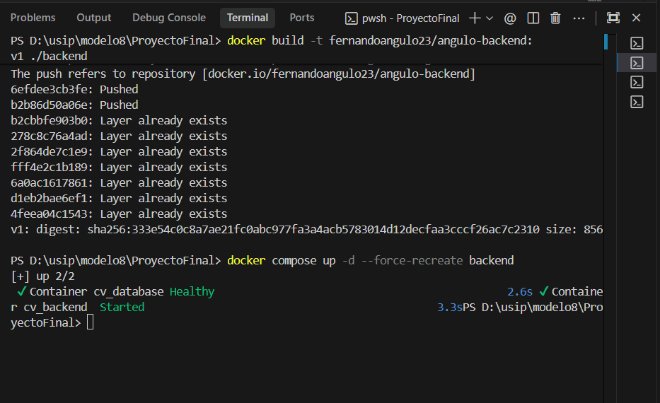
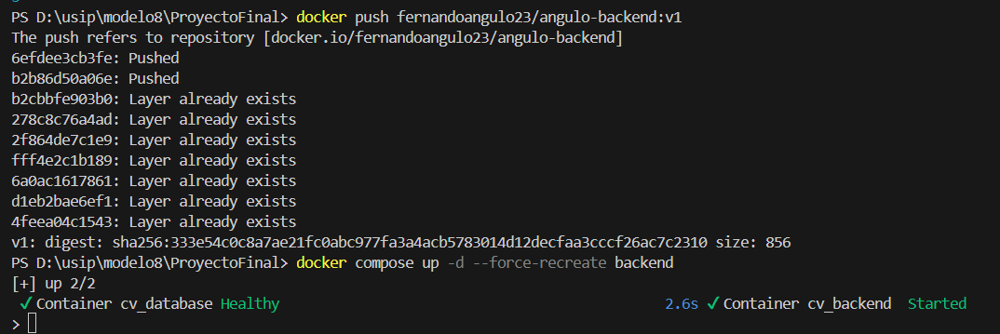
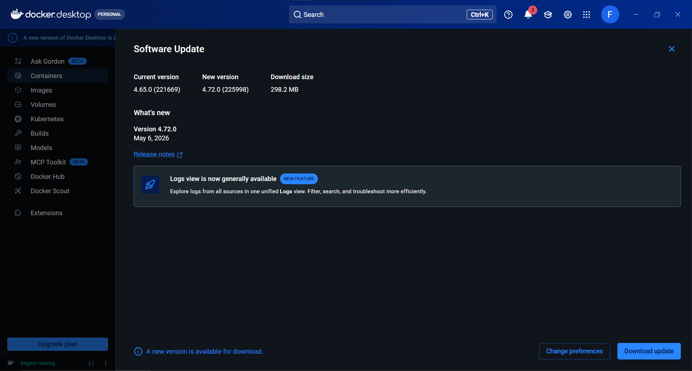
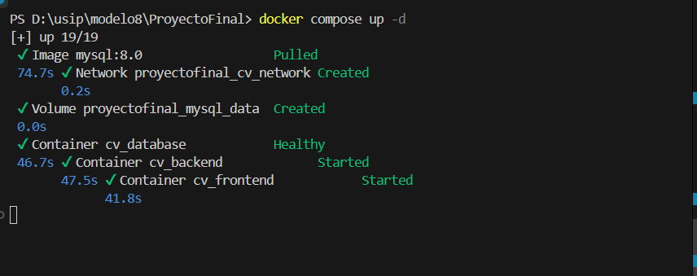
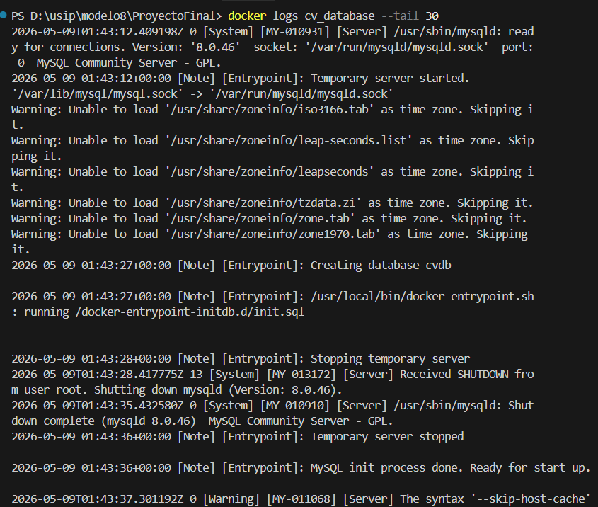
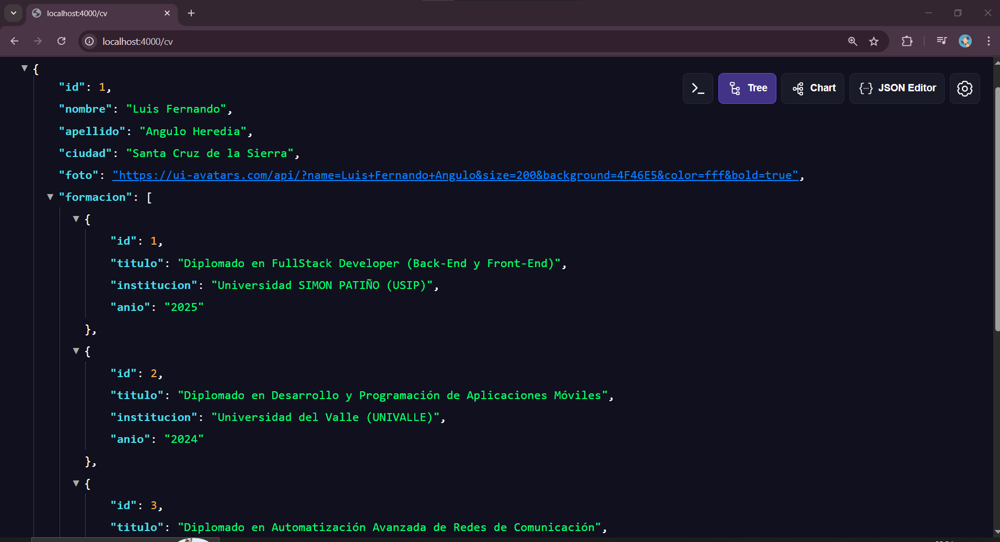
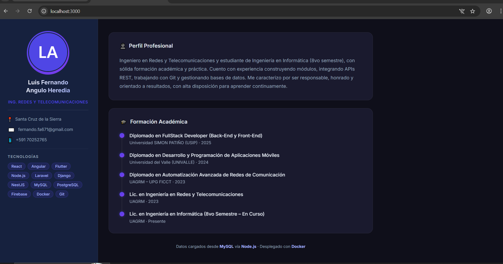

# Informe de Entrega — Práctica Final
## Aplicación Web CV Personal con Docker Compose

---

**Estudiante:** Luis Fernando Angulo Heredia  
**Materia:** Contenedores y Orquestación  
**Facultad de Postgrado — Universidad SIMON PATIÑO (USIP)**  
**Fecha:** Mayo 2026

---

## 1. Datos del Proyecto

| Campo | Valor |
|-------|-------|
| **URL del repositorio en GitHub** | https://github.com/luisfernandoAngulo28/Pr-ctica-Final-Modulo-8 |
| **Imagen Frontend en Docker Hub** | `fernandoangulo23/angulo-frontend:v1` |
| **Imagen Backend en Docker Hub** | `fernandoangulo23/angulo-backend:v1` |
| **Comando de inicio** | `docker compose up -d` |
| **URL de acceso** | `http://localhost:3000` |

---

## 2. Descripción del Proyecto

La práctica consiste en desarrollar y desplegar un sitio web que muestra el CV personal del estudiante. La solución está compuesta por:

- **Frontend** en ReactJS (servido con Nginx)
- **Backend** en Node.js (Express + endpoint GET /cv)
- **Base de datos** MySQL (inicialización automática con scripts SQL)
- **Docker Compose** para la orquestación completa

### Arquitectura de Servicios

| Servicio | Tecnología | Puerto |
|----------|-----------|--------|
| frontend | React + Nginx (nginx:1.27-alpine) | 3000 |
| backend | Node.js (node:20-alpine) | 4000 |
| database | MySQL 8.0 | 3306 |

Todos los servicios se comunican mediante una **única red Docker**: `cv_network`.

---

## 3. Estructura del Proyecto

```
ProyectoFinal/
├── frontend/
│   ├── Dockerfile          ← Multi-stage: Node build + Nginx serve
│   ├── nginx.conf          ← Proxy /api/ → backend
│   ├── vite.config.js
│   ├── index.html
│   ├── package.json
│   └── src/
│       ├── main.jsx
│       ├── App.jsx         ← Componente CV
│       └── index.css       ← Estilos dark mode
├── backend/
│   ├── Dockerfile          ← node:20-alpine
│   ├── server.js           ← Express + GET /cv + MySQL Pool
│   └── package.json
├── database/
│   └── init.sql            ← Crea tablas e inserta datos automáticamente
└── docker-compose.yml      ← Orquestación completa
```

---

## 4. Estructura de la Base de Datos

### Tabla: `persona`

| Campo | Tipo | Valor |
|-------|------|-------|
| id | INT AUTO_INCREMENT PK | 1 |
| nombre | VARCHAR(100) | Luis Fernando |
| apellido | VARCHAR(100) | Angulo Heredia |
| ciudad | VARCHAR(100) | Santa Cruz de la Sierra |
| foto | VARCHAR(255) | URL del avatar |

### Tabla: `formacion`

| Campo | Tipo |
|-------|------|
| id | INT AUTO_INCREMENT PK |
| titulo | VARCHAR(255) |
| institucion | VARCHAR(255) |
| anio | VARCHAR(50) |
| persona_id | INT (FK → persona.id) |

---

## 5. Instrucciones de Ejecución

### Pre-requisitos
- Docker Desktop instalado y ejecutándose
- Conexión a internet (para descargar imágenes desde Docker Hub)

### Pasos

**1. Clonar el repositorio**
```bash
git clone https://github.com/fernandoangulo23/practica-final-cv.git
cd practica-final-cv
```

**2. Iniciar la aplicación (un solo comando)**
```bash
docker compose up -d
```

**3. Acceder a la aplicación**
```
http://localhost:3000
```

### Flujo automático al ejecutar `docker compose up -d`

1. Docker Compose descarga automáticamente las imágenes desde Docker Hub
2. Inicia el contenedor de MySQL (`cv_database`)
3. MySQL crea automáticamente la base de datos `cvdb`
4. MySQL ejecuta `/docker-entrypoint-initdb.d/init.sql` automáticamente
5. El script SQL crea las tablas `persona` y `formacion`
6. El script SQL inserta los registros del CV
7. Inicia el contenedor del backend (`cv_backend`) con `restart: always`
8. El backend se conecta a MySQL mediante pool de conexiones
9. El backend expone el endpoint `GET /cv` en el puerto 4000
10. Inicia el contenedor del frontend (`cv_frontend`)
11. El frontend consume los datos desde `http://backend:4000/cv`
12. El navegador muestra el CV completo en `http://localhost:3000`

### Detener la aplicación
```bash
docker compose down
```

### Detener y eliminar volúmenes (reset completo)
```bash
docker compose down -v
```

---

## 6. Evidencias

### 6.1 Construcción de imágenes (`docker build`)

**Frontend:**
```
[+] Building 256.3s (17/17) FINISHED        docker:desktop-linux
 => [build 4/6] RUN npm install             223.4s
 => [build 6/6] RUN npm run build             5.1s
 => naming to docker.io/fernandoangulo23/angulo-frontend:v1
```

**Backend:**
```
[+] Building 21.5s (10/10) FINISHED         docker:desktop-linux
 => [4/5] RUN npm install                    15.4s
 => naming to docker.io/fernandoangulo23/angulo-backend:v1
```



> *(Captura del proceso de construcción de imágenes con node:20-alpine y nginx:1.27-alpine)*

---

### 6.2 Publicación en Docker Hub (`docker push`)

**Frontend:**
```
The push refers to repository [docker.io/fernandoangulo23/angulo-frontend]
d1c7c3aaa455: Pushed
...
v1: digest: sha256:45f69530d50e03abfcddd3a55911eba865c7c0bb... size: 856
```

**Backend:**
```
The push refers to repository [docker.io/fernandoangulo23/angulo-backend]
6efdee3cb3fe: Pushed
...
v1: digest: sha256:333e54c0c8a7ae21fc0abc977fa3a4acb5783014... size: 856
```



---

### 6.3 Imágenes publicadas en Docker Hub



---

### 6.4 Ejecución de Docker Compose

```
[+] up 5/5
 ✔ Network proyectofinal_cv_network  Created
 ✔ Volume proyectofinal_mysql_data   Created
 ✔ Container cv_database             Healthy
 ✔ Container cv_backend              Started
 ✔ Container cv_frontend             Started
```



---

### 6.5 Creación automática de la Base de Datos

El script `database/init.sql` se monta automáticamente en `/docker-entrypoint-initdb.d/` y es ejecutado por MySQL al inicializar el contenedor por primera vez. Crea las tablas `persona` y `formacion` e inserta los registros del CV sin intervención manual.

**Logs del contenedor `cv_database` (`docker logs cv_database`):**

```
2026-05-09 01:43:27+00:00 [Note] [Entrypoint]: Creating database cvdb

2026-05-09 01:43:27+00:00 [Note] [Entrypoint]: /usr/local/bin/docker-entrypoint.sh: running /docker-entrypoint-initdb.d/init.sql

2026-05-09 01:43:28+00:00 [Note] [Entrypoint]: Stopping temporary server
2026-05-09T01:43:35.432575Z 0 [System] [MY-010910] [Server] /usr/sbin/mysqld: Shutdown complete
2026-05-09T01:44:10.364560Z 0 [System] [MY-010931] [Server] /usr/sbin/mysqld: ready for connections.
Version: '8.0.46'  port: 3306  MySQL Community Server - GPL.
[Entrypoint]: MySQL init process done. Ready for start up.
```

✅ La base de datos `cvdb` fue creada automáticamente.  
✅ El script `init.sql` fue ejecutado automáticamente desde `/docker-entrypoint-initdb.d/`.  
✅ Las tablas `persona` y `formacion` fueron creadas e insertadas sin intervención manual.



---

### 6.6 Funcionamiento de la aplicación en el navegador

**Endpoint del backend** — `http://localhost:4000/cv`:

```json
{
  "id": 1,
  "nombre": "Luis Fernando",
  "apellido": "Angulo Heredia",
  "ciudad": "Santa Cruz de la Sierra",
  "foto": "https://ui-avatars.com/api/?name=Luis+Fernando+Angulo...",
  "formacion": [
    { "id": 1, "titulo": "Diplomado en FullStack Developer (Back-End y Front-End)", "institucion": "Universidad SIMON PATIÑO (USIP)", "anio": "2025" },
    { "id": 2, "titulo": "Diplomado en Desarrollo y Programación de Aplicaciones Móviles", "institucion": "Universidad del Valle (UNIVALLE)", "anio": "2024" },
    { "id": 3, "titulo": "Diplomado en Automatización Avanzada de Redes de Comunicación", "institucion": "UAGRM – UPG FICCT", "anio": "2023" },
    { "id": 4, "titulo": "Lic. en Ingeniería en Redes y Telecomunicaciones", "institucion": "UAGRM", "anio": "2023" },
    { "id": 5, "titulo": "Lic. en Ingeniería en Informática (8vo Semestre – En Curso)", "institucion": "UAGRM", "anio": "Presente" }
  ]
}
```



**Frontend** — `http://localhost:3000`:



---

## 7. Verificación de Requisitos

| Requisito | Implementado |
|-----------|:------------:|
| Frontend en ReactJS | ✅ |
| Frontend con Nginx (nginx:1.27-alpine) | ✅ |
| Frontend con Dockerfile propio | ✅ |
| Frontend en puerto 3000 | ✅ |
| Backend en Node.js (node:20-alpine) | ✅ |
| Backend con Dockerfile propio | ✅ |
| Endpoint GET /cv | ✅ |
| Backend retorna JSON | ✅ |
| Backend en puerto 4000 | ✅ |
| Base de datos MySQL 8.0 | ✅ |
| Tabla persona con campos requeridos | ✅ |
| Tabla formacion con campos requeridos | ✅ |
| Creación automática de tablas via script SQL | ✅ |
| Inserción automática de registros | ✅ |
| Imagen frontend en Docker Hub: `angulo-frontend:v1` | ✅ |
| Imagen backend en Docker Hub: `angulo-backend:v1` | ✅ |
| Red única Docker: `cv_network` | ✅ |
| Volumen MySQL: `mysql_data` | ✅ |
| depends_on configurado | ✅ |
| restart: always en backend | ✅ |
| Aplicación inicia con `docker compose up -d` | ✅ |
| Muestra: nombre, apellido, ciudad, fotografía | ✅ |
| Muestra: formación académica (listado) | ✅ |
| Datos provienen desde MySQL vía backend | ✅ |
